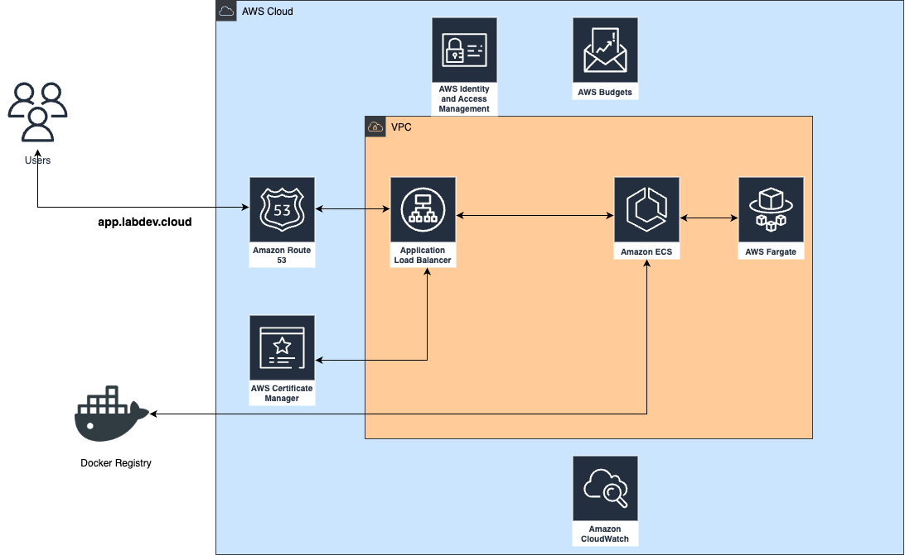
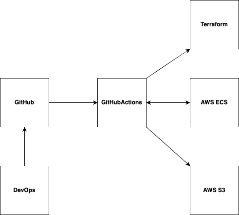

# ProjetoECS

# Projeto com ECS

## Objetivo do projeto

## Premissas do Projeto

## Tecnologias utilizadas no projeto

## Motivações para o uso de cada tecnologia

## Instruções para executar

## Configurações 

**Variáveis armazendas em secrets:**

AWS_ACCESS_KEY_ID => Access Key utilizada para configurar o AWS CLI.

AWS_SECRET_ACCESS_KEY => Secret access Key utilizada para configurar o AWS CLI.

AWS_BUCKET_NAME => Nome do Bucket utilizado para armazenar o estado do projeto Terraform.

TF_BUCKET_NAME => Nome do arquivo utilizado para armazenar o estado do projeto Terraform.

DOCKERHUB_USERNAME => Nome do usuário no Docker Hub.

DOCKERHUB_TOKEN => Token utilizado no Docker Hub.

## Estrutura da solução

## Fluxo da solução

